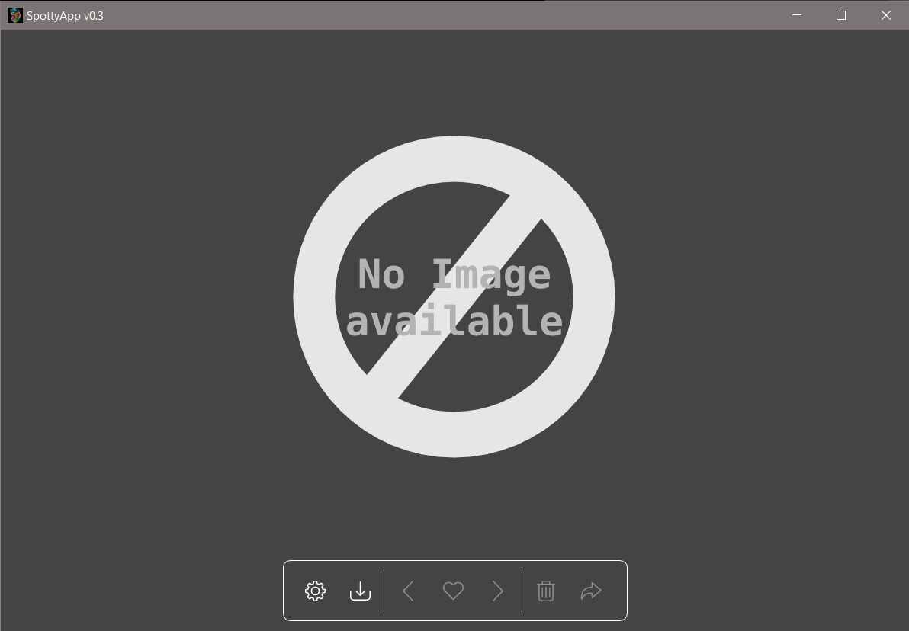
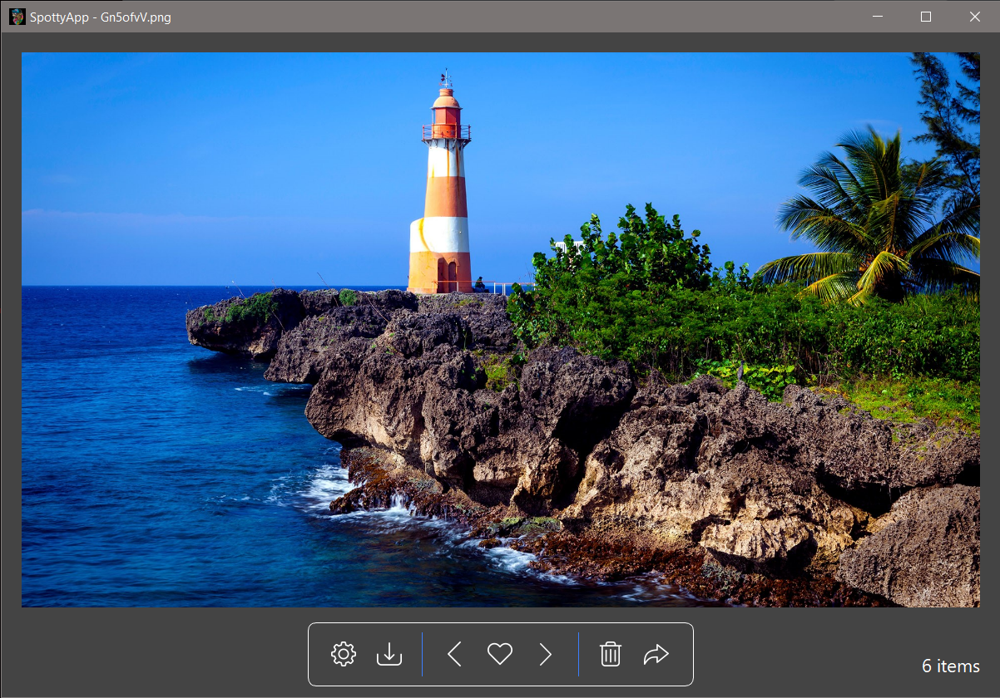
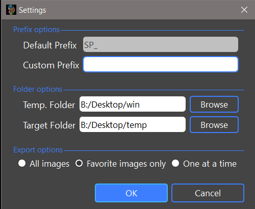
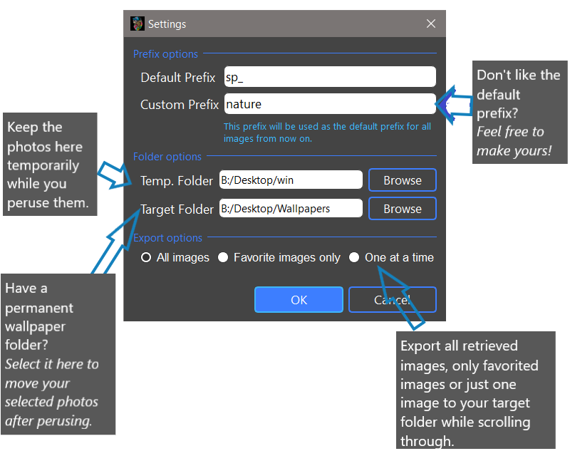
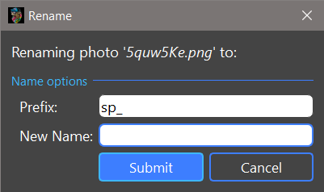

# SpottyApp (SpotlightProgramGUI) v0.1.0
> Completely rewrote [Spotlight Program](https://github.com/CHR-onicles/SpotlightProgram) with GUI using PyQt5.

## Description
> This an app similar to a photo viewer but tailored specifically for Windows Spotlight Photos.
It retrieves the windows spotlight photos (These are the nature-filled wallpapers on your lockscreen on Win 10)
and allows the user to preview, favorite, delete or export on-the-go.
These photos are usually set by default as your lockscreen, but it is worth mentioning that you should at least check to be sure. App has simple
features and has a good amount of tooltips to describe the functions of widgets when you hover over them.

## Requirements
> * Windows 10
> * [PyQt5](https://pypi.org/project/PyQt5/)
> * [send2trash](https://pypi.org/project/Send2Trash/)
> * [Pillow](https://pypi.org/project/Pillow/)

## Run File
> * `SpottyApp.py`
> * Executable provided at [*insert release version here *]()

## Main Window

## Settings Dialog Box

## Rename Dialog Box

## PS:
App is still in development and still needs more features, also, users may encounter some bugs.
Do reach out to me for clarity on anything.

> Contact: tpandivine48@gmail.com, Chronicles#1292 (Discord)

