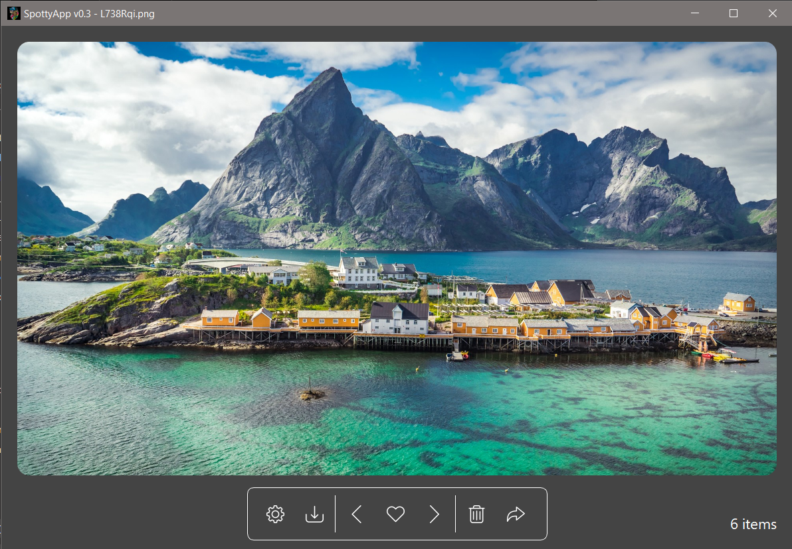

# SpottyApp v0.1
> Completely rewrote [Spotlight Program](https://github.com/CHR-onicles/SpotlightProgram) with GUI using PyQt5.

## Description
> This is an app similar to a photo viewer, but tailored specifically for **Windows Spotlight Photos**.
It retrieves the Windows Spotlight Photos(These are the nature-filled wallpapers on your lockscreen on Win 10)
and allows the user to preview, favorite, delete or export on-the-go.
These photos are usually set by default as your lockscreen, but it is worth mentioning that you should at least check to be sure. App has simple
features and has a good amount of tooltips to describe the functions of widgets when you hover over them.

## Requirements
> * [Windows 10](https://www.microsoft.com/en-us/software-download/windows10)
> * [PyQt5](https://pypi.org/project/PyQt5/)
> * [send2trash](https://pypi.org/project/Send2Trash/)
> * [Pillow](https://pypi.org/project/Pillow/)

## Run File
> * `SpottyApp.py`
> * Executable: [*(release version will be published soon)*]()

## Main Window

## Demo:
[Short Demo](https://imgur.com/zVA7aUH)

## PS:
> * App is still in development and still needs more features, users may also encounter some bugs/glitches.
> * A release version(.exe) is being worked on currently...
> * Contact: tpandivine48@gmail.com

