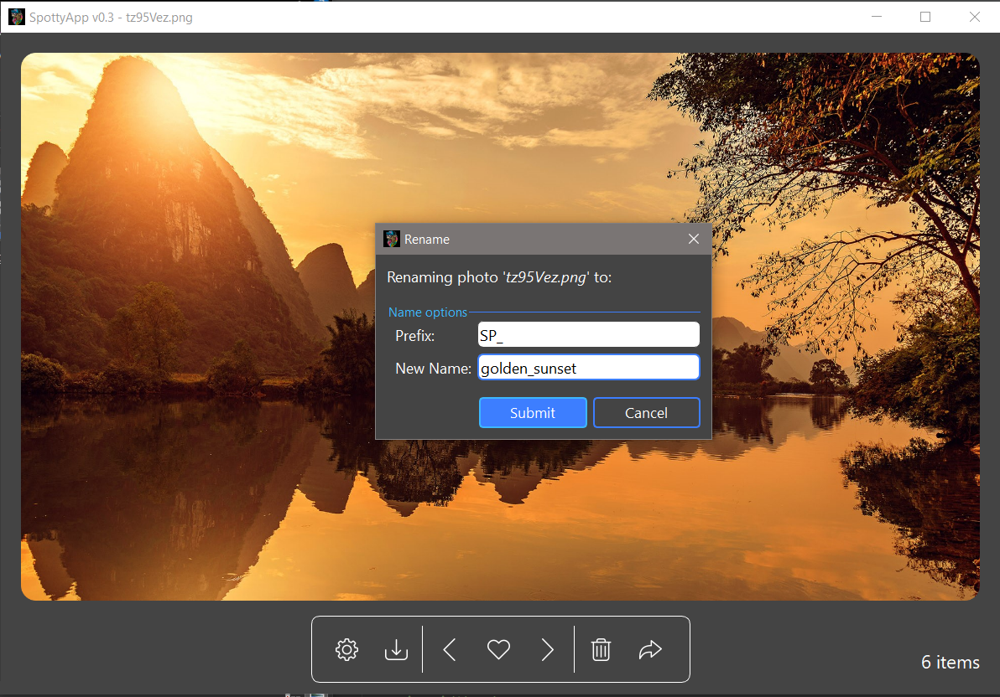

### This repository is no longer maintained by the owner

 

# SpottyApp
> Completely rewrote [Spotlight Program](https://github.com/CHR-onicles/SpotlightProgram) with GUI using PyQt5.

## Description
> This is an app similar to a photo viewer, but tailored specifically for **Windows Spotlight Photos**.
It retrieves the Windows Spotlight Photos (These are the nature-filled wallpapers on your lockscreen on Win 10)
and allows the user to *preview*, *rename*, *delete* or *export* on-the-go.
These photos are usually set by default as your lockscreen.

## Requirements
> * [Windows 10](https://www.microsoft.com/en-us/software-download/windows10)
> * [PyQt5](https://pypi.org/project/PyQt5/)
> * [send2trash](https://pypi.org/project/Send2Trash/)
> * [Pillow](https://pypi.org/project/Pillow/)

## Run Files
> * `main.py`
> * Executable: [First Release](https://github.com/CHR-onicles/SpotlightProgramGUI/releases/tag/v0.3.2)

## Screenshots

## Demo:
[Short Demo](https://imgur.com/zVA7aUH)

 

PS: This app will be rewritten with ElectronJS some time in the future 🤞🏽

